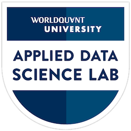
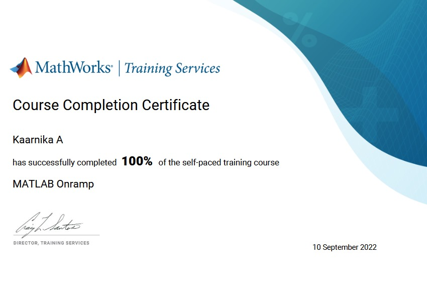
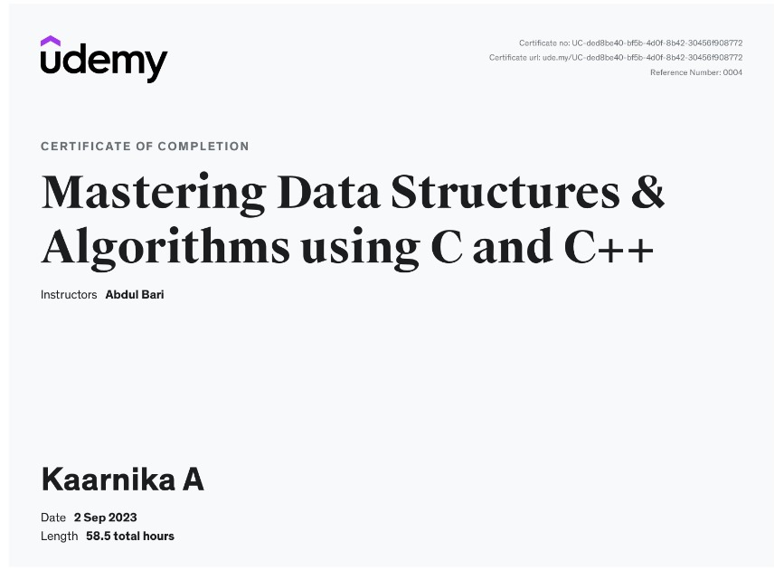

# Data Scientist

#### Programming Skills: Python, C/C++, R
#### Core Skills: Machine/Deep Learning, Analytics&Visualization, Business Intelligence, Statistics
#### Software/Tools Apache, Spark, Power BI/Tableau, Advanced Excel

## Education
- B.Tech., Computer Science and Business Systems | Sri Eshwar College of Engineering (_May 2025_)								       		

## Work Experience
**Data Analyst @ PNT Academy (_Dec 2023_)**
- With a background in testing data prediction algorithms and implementing code solutions for analytical purposes, I have also successfully created a time series model specifically tailored to predict Bitcoin price trends. 
- Additionally,developed interactive dashboards using PowerBI, enabling effective visualization and analysis of data insights

**MERNSTACK DEVELOPER @ Chanel-BTech (_December 2023 - Present_)**
- Interned at Chanel-BTech as a Mernstack Web developer, leading a project for an online vegetable marketplace.
- Spearheaded platform development, enabling direct customer-farmer interaction, cutting intermediary costs.

## Projects
### CoinSight: AI-Powered Cryptocurrency Forecasting
[GitHub ](https://github.com/KaarnikaA/Bitcoin-price-prediction)

Built and validated an ARIMA model to forecast Bitcoin prices with a prediction accuracy of approximately 90%, using over 300 days of historical data and walk-forward validation for precision. Integrated interactive widgets to dynamically tune ARIMA parameters (`p` and `q`), improving model adaptability by 15%. Visualized 50+ days of predicted vs. actual prices using Matplotlib, delivering actionable insights for enhanced trading decisions.

### LSTM-Driven Hangman Player for Optimal Word Guessing
[GitHub ](https://github.com/KaarnikaA/Hangman-Player)

Developed and deployed an LSTM-based model to predict letters in a Hangman word game. Utilized an embedding layer to process word sequences and an LSTM layer to capture dependencies between letters, with a final output layer predicting letter probabilities. Improved game performance by adapting guesses based on previous rounds and dynamic feedback. Demonstrated proficiency in sequence modeling and game AI development.

## Certifications

  

     
    <a href="https://drive.google.com/drive/folders/1LgPrpWRj06sNgy7qc8wKp8Rdh-9NCJg8?usp=sharing">Applied Data Science Lab(World-quant University)</a>
  

     
    <a href="https://drive.google.com/drive/folders/1LgPrpWRj06sNgy7qc8wKp8Rdh-9NCJg8?usp=sharing">Product Management Basics(pendo)</a>
  

     
    <a href="https://drive.google.com/drive/folders/1LgPrpWRj06sNgy7qc8wKp8Rdh-9NCJg8?usp=sharing">Power BI Job Simulation - pwc(Forage)</a>
  

  

     
    <a href="https://drive.google.com/drive/folders/1LgPrpWRj06sNgy7qc8wKp8Rdh-9NCJg8?usp=sharing">Data Analytics Job Simulation - quantium(Forage)</a>
  

  

     
    <a href="https://drive.google.com/drive/folders/1LgPrpWRj06sNgy7qc8wKp8Rdh-9NCJg8?usp=sharing">MATLAB Onramp(MathWorks)</a>
  

  

     
    <a href="https://drive.google.com/drive/folders/1LgPrpWRj06sNgy7qc8wKp8Rdh-9NCJg8?usp=sharing">Data Structures and Algorithms(Udemy)</a>
  

## Publications
1. K. S. M. E., V. K. C., K. A., R. T. R., & P. D. (2024). Revitalizing paddy yields with computer vision. 2024 2nd International Conference on Intelligent Data Communication Technologies and Internet of Things (IDCIoT), Bengaluru, India, 745-749.
2. Jyothikamalesh, S., Kaarnika, A., Mohankumar, M., Vishwakarma, S., Ganguly, S., & Yuvaraj, P. (2024). Efficient VQE approach for accurate simulations on the Kagome lattice. In K. Hemachandran, R. Villamarin, M. Rege, V. Piuri, G. Xu, & K.-L. Ong (Eds.), Artificial Intelligence and Knowledge Processing (pp. 397-409). Springer Nature Switzerland.

- [Data Science Blog](https://medium.com/@shawhin)
